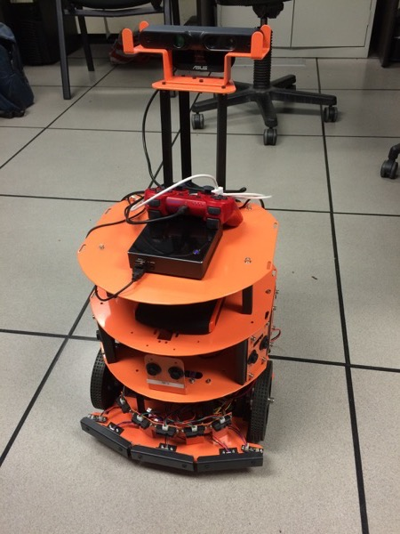
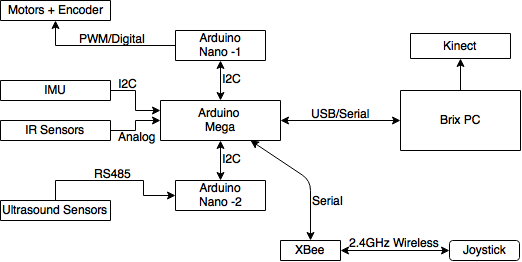
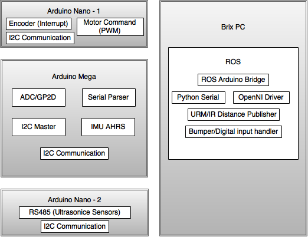

# BeoBot3

#### Mobile Robot for Indoor Navigation
--

#### Specifications:
- Mobile base with wheel encoders
- 6 Ultrasound sensors for distance measurement
- 3 Front facing bumpers
- 11 IR sensors for distance measurement
- 4 Down facing IR sensors for cliff detection
- 1 Asus Xtion Pro Live RGBD camera
- Gigabyte iBrix mini PC with Ubuntu 14.04 and ROS Indigo

#### System Architecture:

#### Software Components:

