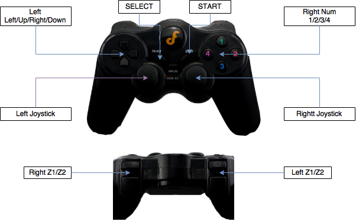
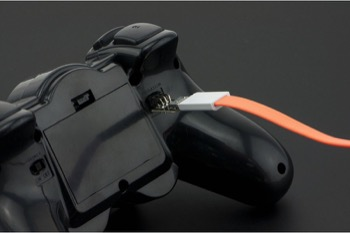

## HCR Robot RC Controller

RC Model: [DF Robot Wireless Gamepad V2.0](http://www.dfrobot.com/index.php?route=product/product&product_id=858#.Vwr5imNWKn0) [[Wiki]] (http://www.dfrobot.com/wiki/index.php/Wirless_GamePad_V2.0_(SKU:DFR0182))

### Gamepad:

### Specifications:
* Enable/Disable Robot
* Give Linear/Angular Velocities to Robot
* Emergency Stop
* Vibration Feedback

### Key Associations:

| Function | Key | 
| ---| --- |
| Start| Push and Hold START for 1 second |
| Emergency Stop | Right num (1) |
| Stop the robot | Left/Right Z1 |
| Linear Velocity | Left/Right Z2 + Left Joystick |
| Angular Velocity | Left/Right Z2 + Right Joystick | 
| Calibrate Joysticks | Left Z1 + Right num (2) |
| Change Linear Velocity| Right Z1 + Left Up/Down Arrow|
| Change Linear Velocity| Right Z1 + Left Left/Right Arrow|
| Enable ROS | Press and Hold SELECT for 3 seconds |

### TO-DO:
* Implement handshaking to ensure the commands are received by the robot.
* Adjust/fine-tune the joystick.

### Warning:
* Do not press ANALOG button. This freezes all the joystic buttons (Temporary fix: Restart the controller)
* (IMPORTANT!!) While connecting Arduino programming header, make sure the it's as shown in the image below: 

