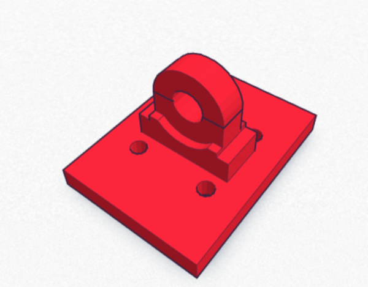
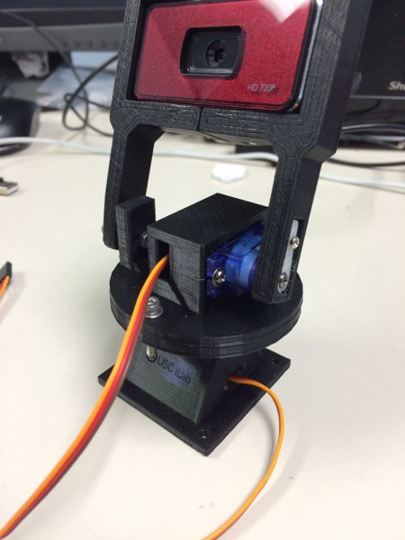
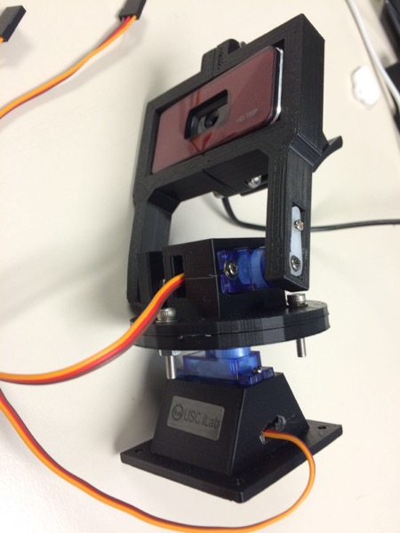

## BeoBot3 
#### Miscellaneous Files
---
This directory contains miscellaneous files used for the project. Designs for all 3D printed parts are stored here.

### Asus Xtio Pro Live Mount
This mount can be used to mount Asus Xtio Pro Live camera on the robot. This can be snapped on to rotating fixture on Asus Xtion camera.

Design location: [Tinkercad](https://tinkercad.com/things/gU7ryKgmKkC) 

### Pan-Tilt Camera Mount
This mount is used to hold [ODROID webcam] (http://www.hardkernel.com/main/products/prdt_info.php?g_code=G137517754892) and has 2-Degrees of freedom for rotation. This uses [9G micro servos] (http://www.amazon.com/RioRand-micro-Helicopter-Airplane-Controls/dp/B00M8RGGFG?ie=UTF8&keywords=servo%20motor&qid=1460148918&ref_=sr_1_7&sr=8-7) for pan and tilt movements and can be controlled by PWM signal. 

This can be used to implement object tracking or surprise detection algorithm on robot.

##### Important notes:
* [Datasheet] (http://www.micropik.com/PDF/SG90Servo.pdf)
* Connections:
	- Orange: PWM Input
	- Red: Vcc
	- Brown: Gnd
* Gears are very soft (they are plastic) and break if you try to twist it with force!
* Thingiverse link: [Thingiverse] (http://www.thingiverse.com/thing:1540658)